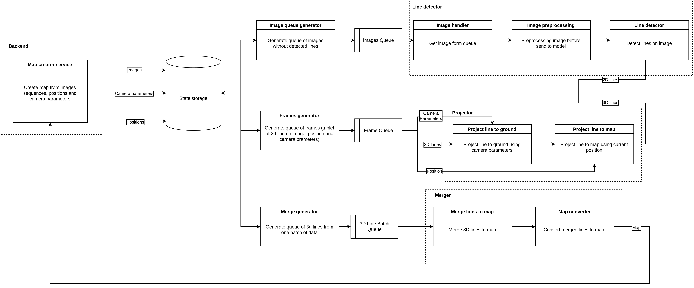
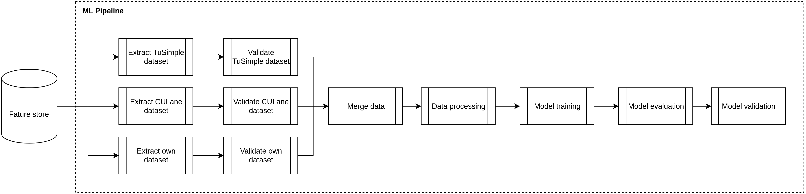

# Map builder 

## Описание

Сервис осуществляет автоматическое построение карт дорожних линий.
При получении карты используется 3 основных сервиса:

- Сервис для распознавания линий на изображении
- Сервис для проецирования 2d линий на изображений в 3d пространство
- Сервис для построения карты по набору 3d линий

## Запуск сервиса

Установить окружение:

``` shell
# Локально
> python -m pip install -e .

# Docker
> export DOCKER_UID=1000
> export DOCKER_GID=1000
> docker-compose run workspace
```

Получить даные из хранилища DVC:

``` shell
# Ключи от S3 хранилища
> export AWS_ACCESS_KEY_ID='00421c5bdbab80c0000000004'
> export AWS_SECRET_ACCESS_KEY='K004Px28gjnnw9wANF7AXpKpiNJ/iF0'
# Получение весов модели
> dvc pull data/model.ckpt
```

Запуск сервиса:

``` shell
make run
```

## Architecture draft



## ML pipeline draft



## Данные

Данные представляют собой набор из изображений с камеры на машине, которая передвигается
по автомобильным дорогам. Для каждого изображение существуют максимум 4 дорожные линии (две слева две справа) в виде кривых.

Для детекции линий используются 2 датасета:

- [CULane](https://xingangpan.github.io/projects/CULane.html)
- [TuSimple](https://github.com/TuSimple/tusimple-benchmark/tree/master/doc/lane_detection)

## Модели для разпознавания 2d линий на изображении

- [Unet](https://arxiv.org/abs/1505.04597) 
- [LaneNet](https://maybeshewill-cv.github.io/lanenet-lane-detection/)

## Метрики

### Метрики распознавания линий

При оценке задачи распознавания линий дороги необходимо следить за двумя свойствами модели: как хорошо линии распознаются и как хорошо определяется класс линии.

- Для оценки качества распознавания можно использовать подход [предложенный в CuLane](https://unsupervised-llamas.com/llamas/benchmark_splines).
  На вход мы имеем предсказанную и ground truth кривые линий на изображении. 
  Допускаем ошибку 30 пикселей (берём пиксели принадлежащие кривым и добавляем к 
  ним соседние пиксели на расстоянии 30 пикселей как принадлежащие линиям). 
  После этого считаем задетектированные линии как:
  - **TP** если есть линия из **GT** совпадает с **IoU > 0.5**
  - **FP** если у распознанной линии нет такой пары из **GT**
  - **FN** если у линии из **GT** нет пары из распознанных
  
  Используя полученные значения TP FP и FN можем вычеслить метрики как 
  - **Recall**
  - **Precision**
  - **F1**

- Для оценки качества определения класса линии (пунктир, сплошная и тд) применяются метрики:
  - **Recall**
  - **Precision**
  - **F1**

## Ограничения сервиса

Для данного сервиса могут быть установлены следующие ограничения:

- Железо: для обработки изображений высокого качества и размера требуется мощное железо с высокой производительностью, такое как процессор Intel Core i5 или выше и видеокарта NVIDIA GeForce GTX 1080 Ti или аналогичная. Так же при уменьшении требованию к FPS и качеству распознавания можно использовать более экономное железо, например Nvidia Jetson
- FPS: так ка не ставится задача распознавания линий в реальном времени, то FPS не является сдерживающим фактором, но в связи с ограничением ресурсов предпологается, что модель выдаёт FPS ~4-10 кадров в секунду.
- Размер изображения: размер изображения также влияет на производительность системы. Разрешение изображения предполагается не более 1920 x 1080 пикселей.
- Размер набора данных: для ограничения времени обработки одного набора данных от пользователя, возможно обозначить ограничения набора данных не более чем 500 изображениями.

## Масштабирования

Система поддаётся масштабированию так как возможно независимо обрабатывать изображения 
посредствам формирования очереди, которую могут обрабатывать множество
машин.

Также независимо на разных машинах можно обрабатывать другие подзадачи: проекция линий и формирования карты.

## Разметка данных

[ТЗ для разметки дорожных линий](doc/labeling.pdf)

## Результаты

**TuSimple:**

| Test metric                     | LaneNet | UNet  |
|:-------------------------------:|:-------:|-------|
| TP (CuLane metric)              | 7173    | 5323  |
| FP (CuLane metric)              | 3195    | 4295  |
| FN (CuLane metric)              | 2771    | 3521  |
| Precision (CuLane metric)       | 0.692   | 0.553 |
| Recall (CuLane metric)          | 0.721   | 0.602 |
| F1 (CuLane metric)              | 0.706   | 0.577 |
| Accuracy (Binary segmentation)  | 0.944   | 0.921 |
| Precision (Binary segmentation) | 0.620   | 0.442 |
| Recall (Binary segmentation)    | 0.454   | 0.312 |
| F1 (Binary segmentation)        | 0.979   | 0.814 |
